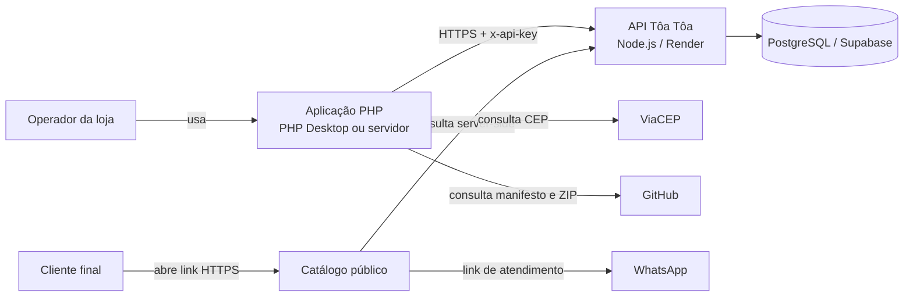
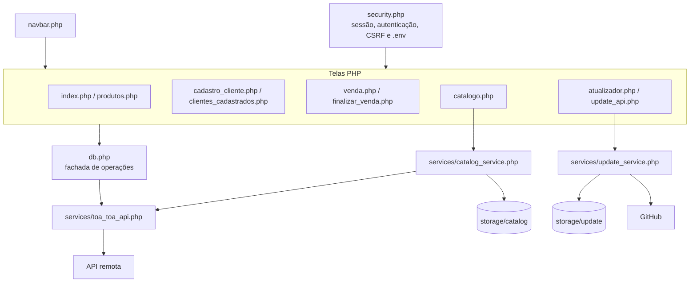
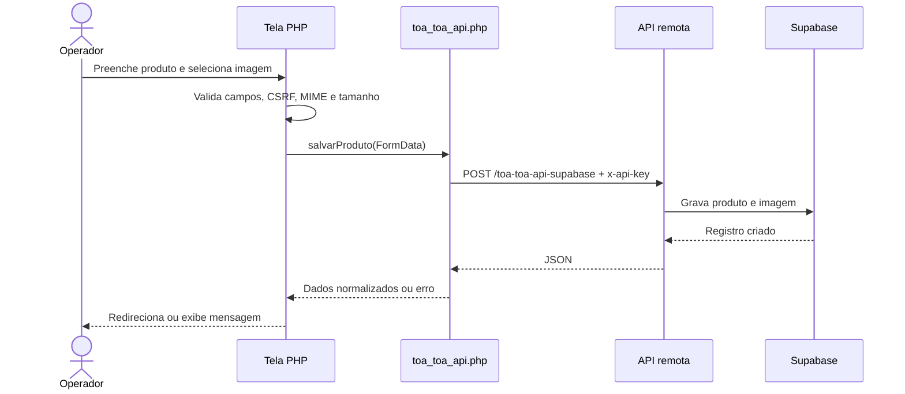
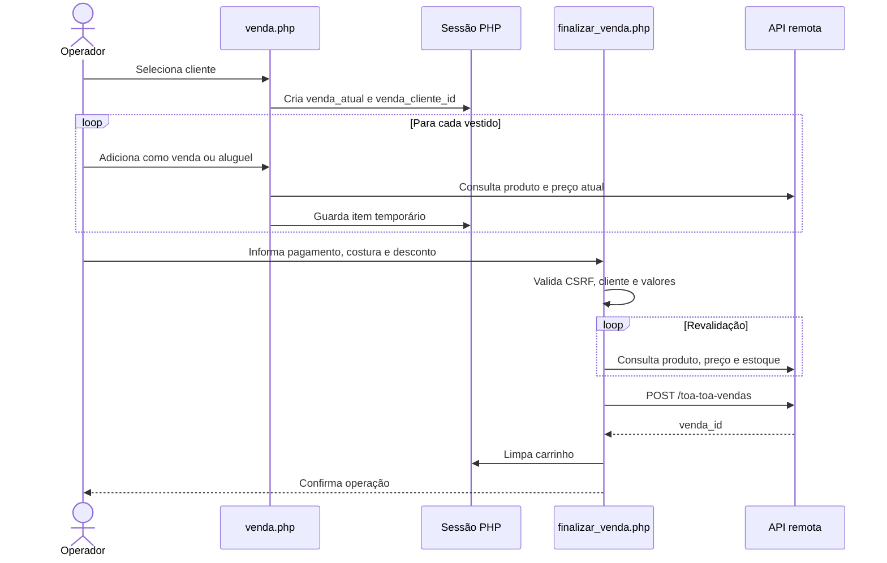
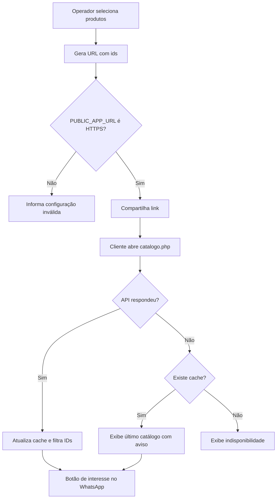
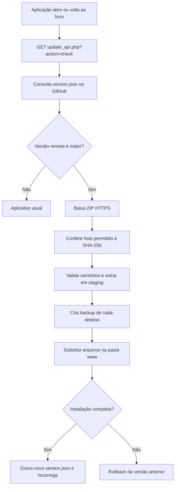
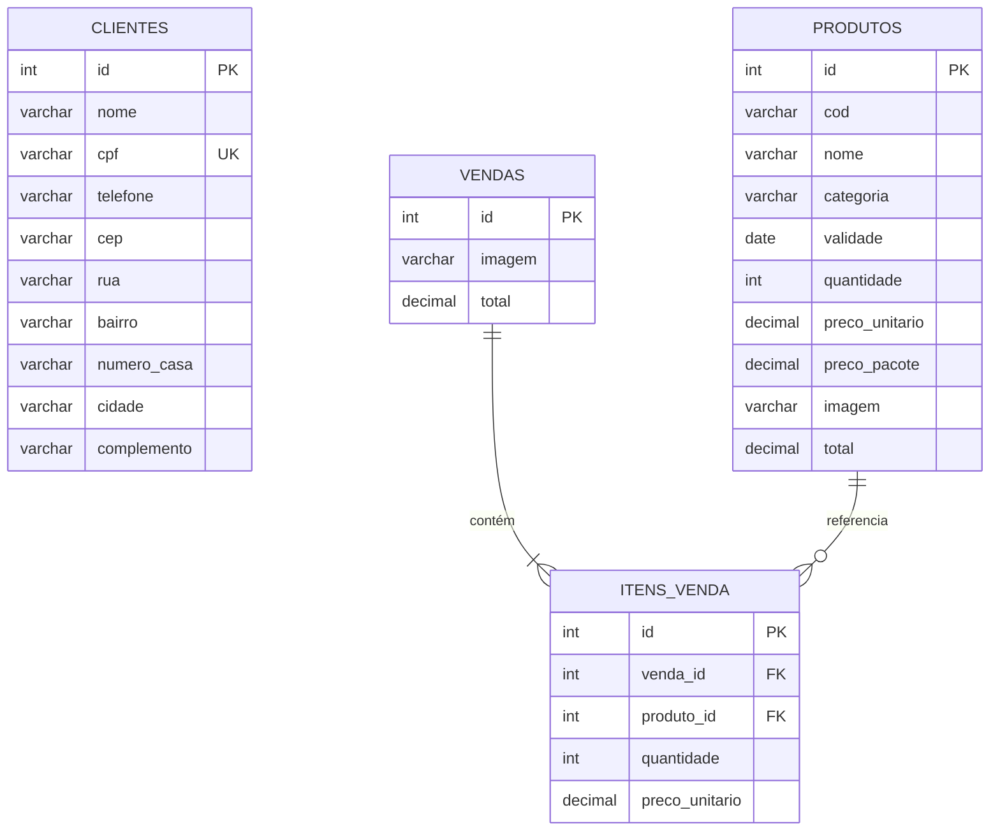

# Tôa Tôa Moda Festa — Sistema de Gestão

Aplicação desktop/web para gestão de produtos, clientes, vendas, aluguéis e catálogos da **Tôa Tôa Moda Festa**. A interface é escrita em PHP e pode ser executada no PHP Desktop ou em um servidor web. Os dados operacionais são acessados por uma API remota protegida por chave.

> Versão documentada: **1.1.2**  
> Repositório: <https://github.com/MatheusMorimoto/toa-toa-telas>

## Sumário

- [Visão geral](#visão-geral)
- [Arquitetura](#arquitetura)
- [Módulos e arquivos](#módulos-e-arquivos)
- [Fluxos funcionais](#fluxos-funcionais)
- [Modelo de dados](#modelo-de-dados)
- [Integrações e endpoints](#integrações-e-endpoints)
- [Segurança](#segurança)
- [Configuração](#configuração)
- [Instalação no PHP Desktop](#instalação-no-php-desktop)
- [Execução em servidor PHP](#execução-em-servidor-php)
- [Catálogo público e WhatsApp](#catálogo-público-e-whatsapp)
- [Atualização automática](#atualização-automática)
- [Testes](#testes)
- [Solução de problemas](#solução-de-problemas)
- [Limitações conhecidas](#limitações-conhecidas)

## Visão geral

O sistema oferece:

- cadastro, consulta, edição e exclusão de produtos;
- upload validado de imagens JPEG, PNG e WebP;
- cadastro e consulta de clientes;
- montagem de venda ou aluguel em sessão;
- validação final de estoque e preços pela API;
- catálogo público de produtos selecionados;
- compartilhamento por WhatsApp;
- cache local do catálogo para contingência;
- autenticação administrativa opcional;
- proteção CSRF nos formulários mutáveis;
- atualização automática assinada por SHA-256;
- execução empacotada pelo PHP Desktop.

### Tecnologias

| Camada | Tecnologia |
|---|---|
| Interface | PHP 8.1+, HTML5, CSS, Bootstrap 5 e Bootstrap Icons |
| Desktop | PHP Desktop Chrome 130.1 / PHP 8.3 |
| Cliente HTTP | PHP cURL, com fallback para streams em operações não multipart |
| API | Serviço Node.js/Express hospedado no Render |
| Dados remotos | PostgreSQL/Supabase, acessado exclusivamente pela API |
| Dados locais legados | Dumps MySQL em `banco de dados/` |
| Atualizações | GitHub, manifesto JSON, ZIP e SHA-256 |
| Certificados | Pacote público `certificates/cacert.pem` |

## Arquitetura

### Diagrama de contexto



### Diagrama de componentes



### Dependências externas em tempo de execução

- API Tôa Tôa: dados de produtos, clientes e vendas.
- GitHub: manifesto e pacotes de atualização.
- ViaCEP: preenchimento de endereço no cadastro de cliente.
- CDN jsDelivr: Bootstrap e Bootstrap Icons.
- WhatsApp: abertura da conversa de interesse no catálogo.

Sem internet, as telas administrativas que dependem da API não conseguem operar. O catálogo pode exibir o último cache salvo. Os arquivos CSS locais e a aplicação continuam abrindo, mas componentes carregados por CDN podem perder estilo ou ícones.

## Módulos e arquivos

### Telas e controladores

| Arquivo | Responsabilidade |
|---|---|
| `index.php` | Formulário de cadastro de produto e preview da imagem |
| `salvar_produto.php` | Valida o upload e envia o novo produto à API |
| `produtos.php` | Lista, pesquisa e seleciona produtos para catálogo |
| `editar_produto.php` | Visualiza, altera ou exclui produto |
| `cadastro_cliente.php` | Cadastra, visualiza, altera e exclui cliente; consulta ViaCEP |
| `clientes_cadastrados.php` | Lista e pesquisa clientes; inicia uma operação |
| `venda.php` | Mantém o carrinho de venda/aluguel na sessão |
| `finalizar_venda.php` | Revalida itens, calcula operação e registra na API |
| `catalogo.php` | Página pública dos produtos selecionados |
| `login.php` / `logout.php` | Entrada e saída quando a autenticação está habilitada |
| `atualizador.php` | Interface manual de atualização |
| `update_api.php` | Endpoint JSON de verificação e instalação |
| `navbar.php` | Cabeçalho compartilhado, busca e verificação automática |

### Serviços e infraestrutura

| Arquivo | Responsabilidade |
|---|---|
| `security.php` | Carrega `.env`, inicia sessão, autentica, gera e valida CSRF |
| `db.php` | Fachada PHP para produtos, clientes, vendas e health check |
| `services/toa_toa_api.php` | Transporte HTTPS, chave da API, certificado, upload e erros |
| `services/catalog_service.php` | IDs, URL pública, WhatsApp e cache do catálogo |
| `services/update_service.php` | Manifesto, download, validação, instalação e rollback |
| `certificates/cacert.pem` | Autoridades certificadoras usadas pela API e pelo atualizador |
| `version.json` | Versão instalada/publicada e hash do pacote |
| `settings.json` | Configuração do executável PHP Desktop |
| `tools/build-update-package.ps1` | Gera o ZIP imutável e atualiza o manifesto |

### Diretórios de dados

| Caminho | Conteúdo | Atualizado pelo pacote? |
|---|---|---|
| `storage/catalog/` | Cache do catálogo público | Não |
| `storage/update/` | cache, log, transações e backups | Não |
| `imagens/` | imagens locais legadas | Não |
| `banco de dados/` | dumps MySQL de referência | Não |
| `releases/` | pacotes ZIP publicados | Não é instalado dentro da aplicação |

## Fluxos funcionais

### Produtos



Regras do upload:

- tamanho máximo de 10 MB;
- tipos permitidos: `image/jpeg`, `image/png` e `image/webp`;
- requer `fileinfo` e cURL;
- a URL retornada pela API é usada diretamente;
- imagem ausente ou URL inválida usa `toatoa.png`.

### Venda e aluguel



Regras principais:

- cada carrinho pertence a um cliente;
- tipos aceitos: `venda` e `aluguel`;
- pagamentos aceitos: dinheiro, Pix, crédito e débito;
- venda exige estoque disponível;
- desconto não pode superar subtotal mais costura;
- preço e estoque são reconsultados antes da confirmação.

### Catálogo público



Os IDs aceitam apenas letras, números, `_` e `-`, com no máximo 64 caracteres por ID e 100 itens por catálogo. A chave da API nunca é enviada ao navegador.

### Atualização automática



O nome da pasta externa do PHP Desktop não interfere. O diretório-alvo é calculado a partir de `services/update_service.php`, chegando à pasta da aplicação (`www`).

## Modelo de dados

### Modelo operacional remoto

O código deste repositório não contém as migrações oficiais do backend. A API expõe três recursos conceituais:

- **Produto**: código, nome, categoria, validade, quantidade, preços, imagem e descrição;
- **Cliente**: dados pessoais, contatos, endereço, preferências e data do evento;
- **Venda/Aluguel**: cliente, forma de pagamento, costura, desconto, observações e itens.

A API e seu banco são a fonte de verdade. Mudanças no schema remoto devem ser documentadas no repositório do backend.

### Dumps MySQL locais

Os arquivos em `banco de dados/` representam uma estrutura local/legada e não correspondem integralmente ao contrato atual da API.



O dump local não possui chave estrangeira entre `clientes` e `vendas`.

## Integrações e endpoints

Todas as chamadas autenticadas enviam:

```http
Accept: application/json
x-api-key: valor_de_TOA_TOA_API_KEY
```

| Método | Endpoint | Uso |
|---|---|---|
| `GET` | `/health` | Saúde da API, sem autenticação |
| `GET` | `/toa-toa-api-supabase` | Lista ou pesquisa produtos |
| `GET` | `/toa-toa-api-supabase/{id}` | Consulta produto |
| `POST` | `/toa-toa-api-supabase` | Cria produto multipart |
| `PUT` | `/toa-toa-api-supabase/{id}` | Edita produto multipart |
| `DELETE` | `/toa-toa-api-supabase/{id}` | Exclui produto |
| `GET` | `/toa-toa-clientes` | Lista ou pesquisa clientes |
| `GET` | `/toa-toa-clientes/{id}` | Consulta cliente |
| `POST` | `/toa-toa-clientes` | Cria cliente |
| `PUT` | `/toa-toa-clientes/{id}` | Edita cliente |
| `DELETE` | `/toa-toa-clientes/{id}` | Exclui cliente |
| `POST` | `/toa-toa-vendas` | Registra venda ou aluguel |

O cliente trata respostas `400`, `401`, `404`, `409`, `413`, `422`, `429` e `500`, além de erros de DNS, timeout, conexão e certificado.

## Segurança

- `.env` é carregado apenas no servidor e está ignorado pelo Git.
- A chave da API não é inserida no HTML ou JavaScript.
- Cookies de sessão usam `HttpOnly` e `SameSite=Lax`; `Secure` é ativado em HTTPS.
- Todas as operações mutáveis da interface usam token CSRF.
- Logout e exclusões usam `POST`.
- Redirecionamentos de login rejeitam destinos externos.
- Saídas de dados são escapadas com `htmlspecialchars`.
- Uploads validam tamanho e MIME real.
- URLs de imagem inválidas recebem placeholder local.
- O atualizador aceita apenas HTTPS e hosts GitHub autorizados.
- O pacote precisa corresponder ao SHA-256 do manifesto.
- O ZIP rejeita caminhos absolutos, `..` e links simbólicos.
- `.env`, configurações, banco, imagens e armazenamento local são preservados.
- O certificado público pode ser atualizado; outros arquivos `.pem` permanecem protegidos.

### Autenticação administrativa

Por padrão, `APP_AUTH_ENABLED=false`. Para habilitar:

```powershell
php -r "echo password_hash('SUA_SENHA_FORTE', PASSWORD_DEFAULT), PHP_EOL;"
```

Copie o hash para:

```env
APP_AUTH_ENABLED=true
APP_AUTH_USER=admin
APP_AUTH_PASSWORD_HASH=$2y$...
```

## Configuração

Crie `.env` a partir de `.env.example`:

```env
APP_AUTH_ENABLED=false
APP_AUTH_USER=admin
APP_AUTH_PASSWORD_HASH=

API_BASE_URL=https://api-toa-a-toa-2.onrender.com
TOA_TOA_API_KEY=

MYSQL_HOST=localhost
MYSQL_USER=root
MYSQL_PASSWORD=
MYSQL_DATABASE=produtos_cadastrados

UPDATER_MANIFEST_URL=https://raw.githubusercontent.com/MatheusMorimoto/toa-toa-telas/main/version.json
UPDATER_CHECK_INTERVAL=300
APP_RUNTIME_VERSION=1.0.0

PUBLIC_APP_URL=https://catalogo.seudominio.com
WHATSAPP_BUSINESS_NUMBER=5565999999999
```

| Variável | Obrigatória | Descrição |
|---|---|---|
| `API_BASE_URL` | Sim | URL base HTTPS da API |
| `TOA_TOA_API_KEY` | Sim | Mesmo segredo configurado como chave mestra no backend |
| `APP_AUTH_ENABLED` | Não | Habilita login administrativo |
| `APP_AUTH_USER` | Se login ativo | Usuário administrativo |
| `APP_AUTH_PASSWORD_HASH` | Se login ativo | Hash criado por `password_hash` |
| `PUBLIC_APP_URL` | Para compartilhar | URL HTTPS pública da aplicação |
| `WHATSAPP_BUSINESS_NUMBER` | Não | País + DDD + número, somente dígitos |
| `UPDATER_MANIFEST_URL` | Sim para atualização | Manifesto oficial no GitHub |
| `UPDATER_CHECK_INTERVAL` | Não | Cache da consulta, mínimo efetivo de 60 segundos |
| `APP_RUNTIME_VERSION` | Não | Compatibilidade do instalador base |
| `MYSQL_*` | Legado/opcional | Conexão local inicializada por compatibilidade |

`DB_HOST`, `DB_PORT`, `DB_USER`, `DB_PASSWORD` e `DB_NAME` também existem por compatibilidade, mas as telas atuais não abrem conexão PostgreSQL direta.

## Instalação no PHP Desktop

Estrutura esperada:

```text
phpdesktop-qualquer-nome/
├── php/
├── settings.json
└── www/
    ├── index.php
    ├── .env
    ├── certificates/
    │   └── cacert.pem
    ├── services/
    ├── storage/
    └── demais arquivos do projeto
```

O nome `phpdesktop-qualquer-nome` pode ser alterado. Preserve `www` ou ajuste `www_directory` em `settings.json`.

No `php.ini` do PHP Desktop, habilite:

```ini
extension=curl
extension=fileinfo
extension=openssl
extension=zip
allow_url_fopen=On
```

Passos:

1. copie todo o conteúdo do projeto para `www`;
2. crie e configure `www/.env`;
3. confirme a presença de `www/certificates/cacert.pem`;
4. feche completamente o PHP Desktop;
5. abra novamente o executável.

O cliente da API e o atualizador configuram `CURLOPT_CAINFO` automaticamente com o certificado do projeto.

## Execução em servidor PHP

Requisitos:

- PHP 8.1 ou superior;
- extensões cURL, Fileinfo, OpenSSL e Zip;
- permissão de escrita em `storage/`;
- saída HTTPS para API, GitHub, ViaCEP e CDNs.

Para desenvolvimento:

```bash
php -S 127.0.0.1:8000
```

Acesse <http://127.0.0.1:8000>.

## Catálogo público e WhatsApp

`PUBLIC_APP_URL` precisa apontar para uma instalação web pública em HTTPS. Uma aplicação executada apenas em `127.0.0.1`, `localhost` ou IP privado não pode ser acessada pelo celular do cliente.

Fluxo:

1. abra **Produtos cadastrados**;
2. marque os produtos desejados ou selecione os visíveis;
3. clique em **Gerar link do catálogo**;
4. copie, compartilhe nativamente ou envie pelo WhatsApp.

O cache fica em `storage/catalog/products.json` e é atualizado após uma consulta bem-sucedida.

## Atualização automática

O sistema verifica o manifesto ao abrir telas e quando a janela volta ao primeiro plano. A instalação só ocorre quando a versão remota é maior que a instalada.

### Publicar uma versão

```powershell
powershell -ExecutionPolicy Bypass -File tools/build-update-package.ps1 -Version 1.1.3
git add -A
git add -f releases/toa-toa-1.1.3.zip
git commit -m "Publica versão 1.1.3"
git push origin main
```

O script:

1. reúne arquivos rastreados e novos não ignorados;
2. exclui credenciais, dados locais e pacotes anteriores;
3. gera um ZIP;
4. calcula SHA-256;
5. atualiza `version.json`.

Um simples `git push` de arquivos não publica uma atualização instalável. É obrigatório aumentar a versão e publicar o ZIP referenciado pelo manifesto.

### Recuperação

Cada instalação cria transações em `storage/update/transactions/`. Antes de substituir um arquivo, salva uma cópia. Qualquer falha aciona rollback. O histórico resumido fica em `storage/update/updater.log`.

## Testes

```bash
php tests/run.php
php tests/catalog_test.php
php tests/update_service_test.php
```

Cobertura atual:

- autenticação da API e compatibilidade com `CHAVE_MESTRA`;
- CRUD de produtos e clientes;
- upload multipart;
- venda válida e estoque insuficiente;
- validação de imagem e XSS;
- catálogo, URL pública, WhatsApp e cache;
- versões, manifesto, SHA-256, URLs autorizadas e rollback.

O teste integral do instalador requer `ZipArchive`.

## Solução de problemas

### `Session cannot be started after headers have already been sent`

- use a versão atual de `security.php`;
- inclua `db.php` antes de qualquer HTML;
- salve PHP sem BOM e sem espaços antes de `<?php`.

### `unable to get local issuer certificate`

- confirme `certificates/cacert.pem`;
- copie as pastas `certificates` e `services` completas;
- reinicie o PHP Desktop;
- não desative a validação SSL.

### API não carrega dados

- confira `API_BASE_URL` e `TOA_TOA_API_KEY` no `.env`;
- habilite cURL e OpenSSL;
- teste internet, DNS, proxy e firewall;
- lembre que o Render pode ter atraso de inicialização.

### Atualizador não verifica o GitHub

- confirme `certificates/cacert.pem`;
- habilite cURL, OpenSSL e Zip;
- confirme permissão de escrita em `www` e `storage`;
- consulte `storage/update/updater.log`;
- valide `UPDATER_MANIFEST_URL`.

### Catálogo não gera link

- configure `PUBLIC_APP_URL` com HTTPS público;
- não use localhost ou IP de rede interna;
- verifique permissão de escrita em `storage/catalog`.

### Bootstrap ou ícones não aparecem

A interface usa CDN. Verifique internet e firewall ou hospede essas dependências localmente.

## Limitações conhecidas

- o backend e suas migrações não estão neste repositório;
- os dumps MySQL são legados e não refletem todo o contrato atual;
- o carrinho fica na sessão e não sobrevive à expiração dela;
- o catálogo usa IDs na URL, limitado a 100 produtos;
- Bootstrap e ícones dependem de CDN;
- não há fila offline para alterações administrativas;
- a primeira correção de um atualizador antigo sem certificado exige cópia manual;
- mudanças no executável, PHP ou `settings.json` protegido exigem redistribuição do pacote PHP Desktop.

## Identidade visual

| Cor | Valor | Uso |
|---|---|---|
| Azul profundo | `#001D3D` | fundo e identidade |
| Amarelo ouro | `#FFD700` | títulos, bordas e destaques |
| Verde | `#2D8A4E` | ações positivas |
| Vermelho | `#E60000` | alertas e erros |

---

**Tôa Tôa Moda Festa — Patrocinadora oficial do Miss Mato Grosso**
